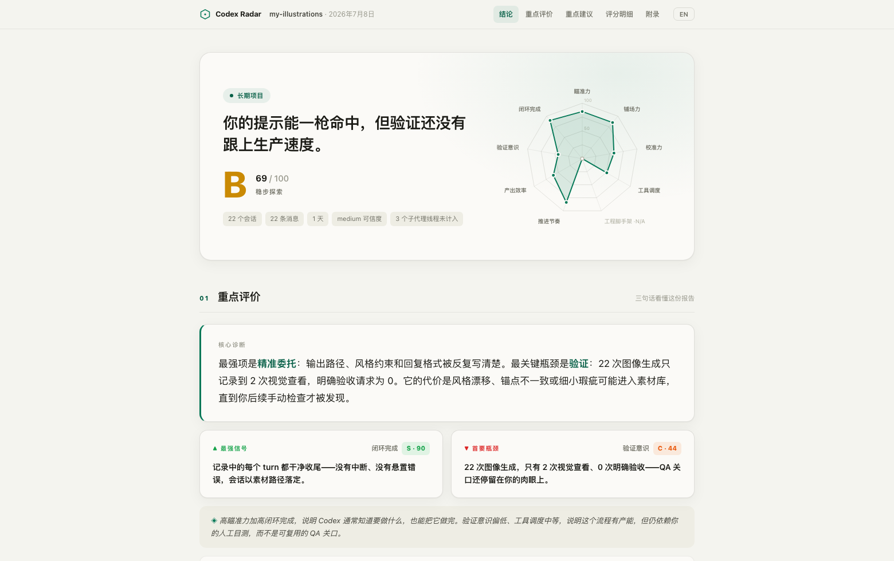

# Codex Radar

> **一款 Codex 插件，读取你本地的 Codex 会话记录，评估你和 Codex 协作的质量。** 从「沟通力 / 工程力 / 成效」三个层面、9 个维度打分 —— 由你自己的 Codex 模型对照公开 rubric 打分并撰写诊断，输出一组可直接粘贴的改写 prompt 和一个专业可读的单文件 HTML dashboard。全程本地。

🌏 [English](./README.md) · 📖 [方法论](./docs/METHODOLOGY_zh.md) · 🖥 [在线预览](https://leifdiao.github.io/codex-radar/) · ⚖️ [协议](./LICENSE)

> **English summary:** A Codex plugin that reads your local Codex session history and grades how well you collaborate with the agent across 9 dimensions in 3 categories. Your own Codex model scores the sessions against a transparent rubric and writes a free-form diagnosis, plus paste-ready improvement prompts and a professional single-file HTML dashboard. 100% local. Full English docs → [README.md](./README.md)




---

## 核心特性

**🎯 评估你真实的 Codex 会话记录，不靠人工题库。** Codex Radar 直接解析 Codex 已经写好的 JSONL —— 兼容新旧两代落盘格式：每条 prompt、每条 shell 命令和它的退出码、每次 `apply_patch` 编辑、每次 plan 更新，以及 MCP / 搜索 / 子代理调用。子代理线程会被剔除（那些"用户消息"是 agent 写的），`codex exec` 批量运行按自动化画像评判，不会冒充你的对话水平。

**💬 你的 Codex 亲自给你写诊断，而不只是给分数。** 确定性解析器提取事实，并**用代码算出全部公式基线**——天然可复现。你的 Codex 模型只做按数据置信度封顶的证据微调（±5/±10/±15），并写出自由格式的协作诊断。每条结论都引用一个带 id、可点击下钻的证据原子。

**📋 建议是类型化干预，不是空话。** 话术改写、工作流 playbook、可直接落盘的 setup 文件（包括自动生成的 `AGENTS.md` 草稿）、工具接入方案、完成定义仪式 —— 每条都基于引用的证据，每条都带一个 `verifyBy` 指标，下次报告可以核对它有没有生效。

**⚖️ 按项目类型公平加权。** 3 条消息修完的 bug、50 个 session 的功能开发、200 次运行的生图流水线，不会用同一把尺子。Codex Radar 自动归类（一次性 / 功能开发 / 长期 / 学习 / **自动化**），按类别套用不同权重。当某个信号确实无法评估时，维度标记为 **N/A**，绝不假装给一个 50 分。

**🛠 专门评估你怎么用平台，不只是怎么说话。** 命令成功率、plan 步骤完成度、MCP 按服务器统计与错误率、子代理编排闭环（spawn 了几个、真正 close 了几个）、网页研究、skills、上下文卫生。验证必须是真正跑过的 —— `echo 验证` 不算，而跑挂了但你做出反应的测试有加分。

**📈 每次运行都记得上一次。** 报告在本地留档 —— 第二次运行起显示分数趋势和各维度 delta（"较上次：验证意识 +9"），和每条建议的 `verifyBy` 形成闭环。

**🔒 全本地，零数据上传。** 只读访问 `~/.codex/sessions`，无 API key、无云端、不发任何网络请求。报告是经过转义的单文件 HTML，写到 `~/.codex-radar/reports/`。

> **English highlights:**
> - **🎯 Reads your real Codex sessions** — prompts, shell exit codes, `apply_patch` edits, plan updates, MCP / search / image / subagent calls
> - **💬 Your Codex writes the diagnosis** — facts parser + model scoring against a transparent rubric (formula baseline + evidence-cited adjustment)
> - **📋 Every suggestion is a paste-ready prompt** with its expected impact
> - **⚖️ Project-type-aware weighting** — N/A instead of a faked 50 when a signal can't be evaluated
> - **🛠 Evaluates platform leverage** (shell / patch / plan / MCP / search / image / subagents + AGENTS.md scaffolding)
> - **🔒 100% local, zero telemetry**
>
> Full English version → [README.md](./README.md)

---

## 报告里有什么

让 Codex 运行这个插件，你会得到一个单文件 HTML dashboard，按「教练报告」的层级排版 —— 结论在最前，证据一点即达：

**结论** —— S 到 D 的总评等级配一句话 insight、你被评判所用的项目画像、一张真实的九维雷达图，第二次运行起还有分数趋势。

**重点评价** —— 核心诊断以大字引言呈现，配两张高亮卡：你的**最强信号**和**首要瓶颈**，各自钉在一个维度上，点击即跳到评分依据。完整协作画像与跨类别模式解读折叠在下方。

**重点建议** —— 最该先做的那一条被聚焦展示，附引用证据、可直接复制的 prompt 和供下次报告核对的 `verifyBy` 指标；其余类型化建议（话术改写 / 工作流 playbook / setup 文件 / 工具接入 / 验证仪式）收成单行折叠列表；项目缺 AGENTS.md 时还会附一份由会话史生成的草稿。

**评分明细** —— 三大类别分块，每类 0-100 分，下挂 3 个维度：

| 类别 | 维度 |
| --- | --- |
| **沟通力** | Lock-On 瞄准力 · Scene Setting 铺场力 · Steering 校准力 |
| **工程力** | Toolcraft 工具调度 · Architecture 工程脚手架 · Tempo 推进节奏 |
| **成效** | Efficiency 产出效率 · Proof Check 验证意识 · Completion 闭环完成 |

每个维度行都可展开：公式基线、有界的证据微调、评分理由，以及较上次运行的 delta。

**附录** —— 默认折叠：卡壳点（命令重试空转、纠偏、被中断的回合）、近期会话下钻、被引用的证据原子，以及平台指标 —— 工具类别、MCP 按服务器统计、子代理编排闭环、plan 完成度、上下文卫生、项目资产、命令成功率。

---

## 安装

**第一步** —— 添加插件市场（这个仓库本身就是一个 Codex marketplace）：

```bash
codex plugin marketplace add LeifDiao/codex-radar
```

**第二步** —— 安装插件：

```bash
codex plugin add codex-radar@codex-radar-marketplace
```

**本地安装：**

```bash
git clone https://github.com/LeifDiao/codex-radar.git ~/codex-radar
codex plugin marketplace add ~/codex-radar
codex plugin add codex-radar@codex-radar-marketplace
```

安装后请**开一个新 thread**，让 Codex 加载新的 skill。

---

## 使用

Codex Radar 通过自然语言触发，没有需要记的斜杠命令。在新 thread 里说：

```text
Run Codex Radar on this project
```

1. Codex Radar 在本地会话记录里检测你的当前工作目录，问你是不是分析这个项目。
2. 确认即用，或者从「最近项目」列表里选。
3. 解析 + 评分 —— 几秒钟，纯 Node，不用等模型。
4. Dashboard 写入 `~/.codex-radar/reports/`，并把路径打印出来供你打开。

像 *"Analyze my Codex collaboration"* 或 *"Create a Codex Radar report"* 这样的起手 prompt 同样有效。

---

## 环境要求

- **Codex CLI** —— 支持插件版本
- **Node.js 18+**
- 不用 `npm install`、不用编译、不用服务

---

## 隐私

你的会话数据始终留在本地：

- 所有计算本地完成 —— 不发任何网络请求、无 API key、无遥测
- `~/.codex/sessions`、`~/.codex/archived_sessions`、`~/.codex/session_index.jsonl` 只读访问
- 报告写入 `~/.codex-radar/reports/`（临时 JSON 写入 `~/.codex-radar/temp/`）
- 项目资产检测只判断 `AGENTS.md`、`.git`、测试目录等文件是否存在，从不读取它们的内容
- 报告可能包含你自己 prompt 的短片段作为证据 —— 除非你主动分享，否则请把 HTML 当作私有文件

完整数据清单见 [PRIVACY.md](./PRIVACY.md)。

---

## 评分原理

**三层架构，与 [Claude Radar](https://github.com/LeifDiao/claude-radar) 一致：**

1. **事实 + 基线** —— `parse-codex-project.mjs` 给会话分类（交互式 / 自动化 / 子代理），跨两代落盘格式按 `call_id` 把工具调用与输出 join 起来，提取可计数信号和一层可按 id 引用的证据（原子 / 会话叙事 / 关键事件），并**用代码算出全部 9 个公式基线**。确定性：同一输入 → 同一份事实、同一组基线。
2. **微调 + 诊断** —— 你的 Codex 模型读取事实和 `data/rubric.json`，对每个维度做按置信度封顶的有界微调，写出有据可查的观察清单、诊断，以及按各维度配方实例化的类型化建议。
3. **渲染** —— `render-report.mjs` 校验 report schema，追加本地历史，注入趋势与 delta，产出自包含的单文件 HTML。

分析跑在你自己的 Codex 会话里 —— 插件本身不发任何网络请求，也不需要额外的 API key。

👉 [完整方法论](./docs/METHODOLOGY_zh.md)

---

## 评分规则全公开

所有评分输入都在 [`plugins/codex-radar/data/rubric.json`](./plugins/codex-radar/data/rubric.json)：

- 9 个维度的定义（中英）、微调指南、按维度的建议配方
- 5 种项目画像（含 `automation` 自动化）+ 各自的类别权重表
- 按置信度封顶的微调上限 + 等级阈值（S / A / B / C / D）

想让评分更贴合团队习惯？改 rubric 和 `parse-codex-project.mjs` 里的可执行公式，然后跑 `node --test tests/*.test.mjs` —— fixture 测试套件会在两代 Codex 落盘格式上给你兜底。

---

## 项目结构

这个仓库本身就是一个 Codex 插件市场。

```text
codex-radar/
├── .agents/plugins/marketplace.json      # Codex marketplace 清单
├── .github/workflows/test.yml            # CI：语法检查 + fixture 测试
├── docs/
│   ├── index.html                        # GitHub Pages 落地页
│   ├── METHODOLOGY.md / METHODOLOGY_zh.md # 评分规范（中英）
├── tests/                                # fixture 回归测试套件（node --test）
└── plugins/
    └── codex-radar/
        ├── .codex-plugin/plugin.json      # 插件清单
        ├── data/rubric.json               # 9 维定义、建议配方、画像权重
        ├── viewer/template.html           # 单文件 dashboard 外壳
        └── skills/analyze/
            ├── SKILL.md                    # 编排：检测 → 解析 → 微调 → 渲染
            └── scripts/
                ├── lib.mjs                 # 共享工具 + 增量 meta 缓存
                ├── signals.mjs             # 消息分类器、proof/退出码提取
                ├── list-codex-projects.mjs # 项目列表：类型构成 + 噪声折叠
                ├── compute-baseline.mjs    # 你的会话指标分布（自我基准，缓存）
                ├── parse-codex-project.mjs # 事实 + 证据 + 代码计算的基线
                └── render-report.mjs       # 校验 → 历史/delta → 单文件 HTML
```

零运行时依赖。

---

## 协议

Codex Radar 采用 **CC BY-NC 4.0** 协议授权：

- ✅ **免费** 用于个人、教育、研究等任何非商业场景
- ✅ **允许** fork、修改、分享 —— 请注明原作者和原仓库出处，并标注是否做了修改
- ❌ **商业用途**（打包进付费产品、营利组织超出员工个人评估范围、付费 SaaS 托管、基于评分卖报告/分析等）需要单独的商业授权

**商业授权咨询：** **leifdiao@gmail.com**

完整协议条款请见 [LICENSE](./LICENSE)。

---

*为关心 AI 协作质量的人而做。*
